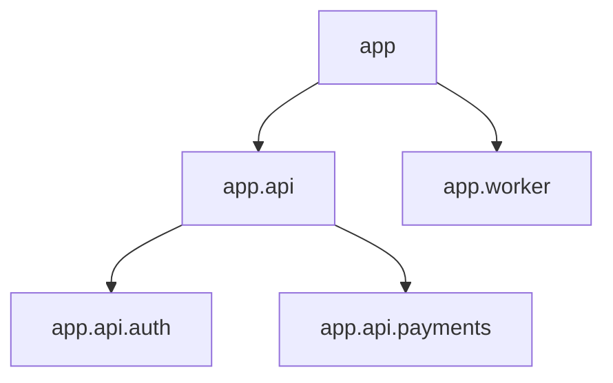
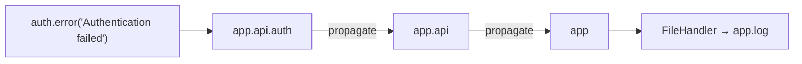
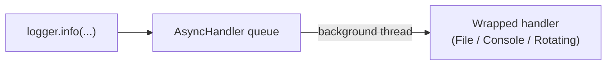

# xylog

A lightweight, hierarchical logging library for Python — built for applications that outgrow the standard library's `logging` module without wanting the ceremony that comes with it.

`xylog` gives you sane defaults out of the box (colored console output, sensible level filtering, thread-safe writes) while staying easy to extend with custom handlers, formatters, and filters when you need more control.

```bash
pip install xylog
```

## Why xylog?

- **Hierarchical by default** — loggers inherit levels and handlers from their parents (`app` → `app.api` → `app.api.auth`), just like you'd expect.
- **Structured context** — attach request IDs, user IDs, or any metadata to a block of code and have it flow into every log line inside it.
- **Async-friendly** — wrap any handler in `AsyncHandler` to move I/O off the hot path.
- **Batteries included** — JSON output, colored terminal output, file rotation, and level-based filtering are all built in.
- **Thread-safe** — write from as many threads as you like without corrupting output.

## Quick Start

```python
from xylog import get_logger

logger = get_logger("Demo")

logger.info("Application started")
logger.debug("Debug message")
logger.warning("Low disk space")
logger.error("Something went wrong")
```

### Catching exceptions

`logger.exception()` captures the traceback alongside your message:

```python
try:
    10 / 0
except Exception as exc:
    logger.exception("Division failed", exception=exc)
```

## Core Concepts

### Loggers are cached

Calling `get_logger()` with the same name always returns the same instance, so you never have to worry about passing loggers around — just call `get_logger("Auth")` wherever you need it.

```python
logger1 = get_logger("Auth")
logger2 = get_logger("Auth")

print(logger1 is logger2)  # True
```

Different names, of course, give you different loggers:

```python
logger1 = get_logger("Auth")
logger2 = get_logger("Database")

print(logger1 is logger2)  # False
```

### Log levels

Set `logger.level` to filter out anything below that severity:

```python
from xylog import get_logger
from xylog.levels import LogLevel

logger = get_logger("Demo")
logger.level = LogLevel.ERROR

logger.info("Hidden")
logger.warning("Hidden")
logger.error("Visible")
```

### Hierarchy and inheritance

Logger names form a dot-separated tree. A logger's `parent` is inferred automatically from its name, and levels cascade down to children that haven't set their own:

```python
app = get_logger("app")
api = get_logger("app.api")
auth = get_logger("app.api.auth")

assert api.parent is app
assert auth.parent is api
```



If a child logger is created *before* its parent exists, `xylog` still resolves the relationship correctly once the parent shows up:

```python
child = get_logger("backend.api.auth")
assert child.parent.name == ""   # falls back to the root logger

parent = get_logger("backend.api")
assert child.parent is parent    # re-linked automatically
```

**Level inheritance** — a child with no level set inherits its `effective_level` from the nearest ancestor that has one:

```python
app.level = LogLevel.WARNING

assert api.level is None
assert api.effective_level == LogLevel.WARNING

assert auth.level is None
assert auth.effective_level == LogLevel.WARNING
```

A child can always override its parent:

```python
auth.level = LogLevel.DEBUG

assert auth.effective_level == LogLevel.DEBUG   # own level wins
assert api.effective_level == LogLevel.WARNING  # still inherited
```

### Propagation

By default, a log record bubbles up through every ancestor logger, so a handler attached at the root catches everything below it:



```python
app = get_logger("application", handlers=[FileHandler("logs/hierarchy.log")])
auth = get_logger("application.api.auth")

auth.error("Authentication failed")
# "Authentication failed" ends up in logs/hierarchy.log
```

Turn it off per-logger with `propagate=False` when you want a subtree to stay quiet:

```python
worker = get_logger("service.worker", propagate=False)
worker.error("Worker failure")
# never reaches the parent's handlers
```

A message is only ever written once, even when several loggers in the chain could see it — no duplicate lines from shared handlers.

## Handlers

Handlers decide *where* a log record ends up. Attach one or more to any logger:

```python
from xylog import get_logger
from xylog.handlers import FileHandler

logger = get_logger("FileLogger")
logger.add_handler(FileHandler("logs/app.log"))

logger.info("Written to file")
```

You can attach as many as you like — a `ConsoleHandler` for humans and a `FileHandler` for records, for instance:

```python
logger.add_handler(FileHandler("logs/demo.log"))
logger.info("Hello")  # goes to both the console and the file
```

### Rotating files

`RotatingFileHandler` caps file size and keeps a configurable number of backups:

```python
from xylog.handlers import RotatingFileHandler

handler = RotatingFileHandler(
    "logs/rotation.log",
    max_bytes=500,
    backup_count=3,
)

logger = get_logger("RotationTest", handlers=[handler])

for i in range(100):
    logger.info(f"This is test message number {i}")

logger.close()
```

### Async handlers

Wrap any handler in `AsyncHandler` to push writes onto a background thread — useful for high-throughput logging where you don't want I/O blocking your request path:



```python
from xylog.handlers import AsyncHandler, FileHandler

handler = AsyncHandler(FileHandler("logs/async.log"))
logger = get_logger("AsyncTest", handlers=[handler])

for i in range(1000):
    logger.info(f"Message {i}")

logger.close()
```

Always call `logger.close()` (or `shutdown()`) when you're done, so buffered messages are flushed before the process exits.

## Formatters

### JSON output

`JsonFormatter` is a good default for anything shipping logs to an aggregator:

```python
from xylog.formatter import JsonFormatter
from xylog.handlers import ConsoleHandler

logger = get_logger(
    "API",
    handlers=[ConsoleHandler(formatter=JsonFormatter())],
)

with logger.context(request_id="req-123", user_id=42):
    logger.info("Request started")
```

### Colored terminal output

`ColoredFormatter` adds ANSI colors per level when writing to a real terminal:

```python
from xylog.formatter import ColoredFormatter
from xylog.handlers import ConsoleHandler

logger = get_logger(
    "API",
    handlers=[ConsoleHandler(formatter=ColoredFormatter())],
)

logger.debug("Debug information")
logger.info("Server started")
logger.warning("Cache miss")
logger.error("Database timeout")
logger.critical("System failure")
```

Color is TTY-aware: pair `ColoredFormatter` with a `FileHandler` and the ANSI codes are stripped automatically, so your log files stay clean even if you reuse the same formatter everywhere.

## Filters

Filters decide whether a record gets through, independent of the logger's own level — handy for routing only certain severities to a specific handler.

```python
from xylog.filters import LevelFilter
from xylog.levels import LogLevel

logger = get_logger(
    "FilterTest",
    level=LogLevel.DEBUG,
    filters=[LevelFilter(LogLevel.ERROR)],
)

logger.debug("Should NOT appear")
logger.info("Should NOT appear")
logger.warning("Should NOT appear")
logger.error("Should appear")
logger.critical("Should appear")

logger.close()
```

Filters can also be scoped to a single handler, so different sinks see different slices of the same stream:

```python
from xylog.handlers import ConsoleHandler, FileHandler

console = ConsoleHandler()  # sees everything

file_handler = FileHandler(
    "logs/errors.log",
    filters=[LevelFilter(LogLevel.ERROR)],  # only errors and above
)

logger = get_logger("HandlerFilterTest", handlers=[console, file_handler])
```

This composes with `AsyncHandler` too — filters are evaluated the same way whether the handler writes synchronously or on a background thread.

## Structured context

Use `logger.context()` to attach metadata to every log call made inside the block — great for request IDs, user IDs, or trace IDs:

```python
logger = get_logger("ContextTest")

with logger.context(request_id="req-123"):
    logger.info("First")

    with logger.context(user_id=42):
        logger.info("Second")   # has both request_id and user_id

    logger.info("Third")        # back to just request_id
```

An explicit `extra=` argument on a single call always wins over whatever's in the surrounding context:

```python
with logger.context(user_id=42):
    logger.info("Test", extra={"user_id": 100})  # user_id=100
```

Need a clean slate for a moment? `clear_context()` temporarily suspends whatever's active:

```python
from xylog import clear_context

with logger.context(request_id="req-123"):
    logger.info("Has context")

    with clear_context():
        logger.info("No context")

    logger.info("Context restored")
```

Context is captured correctly even when the write happens later on a background thread via `AsyncHandler`.

## Extra metadata

Attach one-off structured fields to any log call with `extra=`:

```python
logger.info(
    "User logged in",
    extra={"user_id": 42, "country": "India"},
)
```

## Global configuration

For simple applications, `configure()` sets defaults for every logger without having to pass `level=` or `handlers=` each time:

```python
from xylog import configure, get_logger
from xylog.levels import LogLevel

configure(level=LogLevel.WARNING)

logger = get_logger("app.api")
assert logger.effective_level == LogLevel.WARNING

logger.info("Should NOT appear")
logger.warning("Should appear")
```

A logger created with an explicit `level=` still overrides the global default:

```python
logger = get_logger("app.debug", level=LogLevel.DEBUG)
assert logger.effective_level == LogLevel.DEBUG
```

Calling `configure()` again updates existing loggers immediately:

```python
configure(level=LogLevel.ERROR)
logger = get_logger("app.api")
assert logger.effective_level == LogLevel.ERROR

configure(level=LogLevel.DEBUG)
assert logger.effective_level == LogLevel.DEBUG
```

Global handlers work the same way:

```python
from xylog.handlers import FileHandler

configure(handlers=[FileHandler("logs/config.log")])

logger = get_logger("app.api.auth")
logger.info("Configuration works")
logger.close()
```

## Thread safety

`xylog` is safe to use from multiple threads without any extra locking on your part:

```python
import threading
from xylog import get_logger

logger = get_logger("Threads")

def worker(index: int):
    for i in range(100):
        logger.info(f"Worker {index}: {i}")

threads = [threading.Thread(target=worker, args=(i,)) for i in range(10)]

for t in threads:
    t.start()
for t in threads:
    t.join()
```

## Shutting down

Call `shutdown()` once at the end of your program to flush and close every logger that's been created — particularly important if you're using `AsyncHandler` anywhere:

```python
from xylog import shutdown

shutdown()
```

## License

MIT